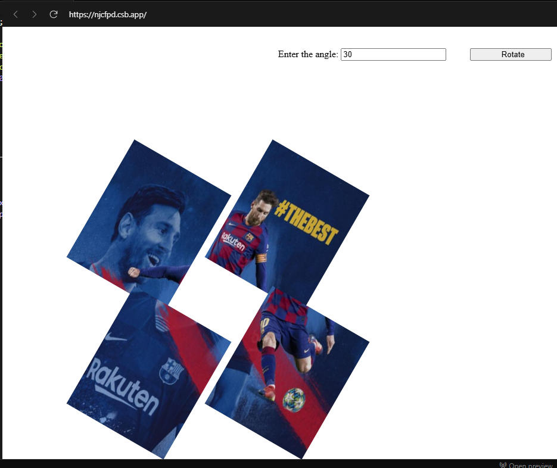

# Approach First

First I tried to rotate each image 

### Code:
```Javascript
import React from "react";

class App extends React.Component {
  constructor(props) {
    super(props);
    this.state = { angle: 0 };
  }

  rotateImage = () => {
    const angle = document.getElementById("angle").value;
    this.setState({ angle: parseInt(angle, 10) || 0 });
  };

  render() {
    return (
      <div className="App">
        <div className="inputTag">
          Enter the angle: <input type="text" name="angle" id="angle" />
          <button className="button" onClick={this.rotateImage}>
            Rotate
          </button>

        </div>
        <div className="container">
          <div className="row">
            <div className="column">
              
            </div>
            <div className="column">
              
            </div>
          </div>
          <div className="row">
            <div className="column">
              
            </div>
            <div className="column">
              
            </div>
          </div>
        </div>
      </div>
    );
  }

}
export default App;
```

### Output Image




# Approach Second, Correct Results

- first I add all the images in a .image-container div.
- The apply `transform: rotation(angle)` in the style section of `.image-container` div.
- it will ensure all the four quadrants will rotate as a single unit.


### Code
```javascript
import React from "react";

class App extends React.Component {
  constructor(props) {
    super(props);
    this.state = { angle: 0 };
  }
  rotateImage = () => {
    const angle = document.getElementById("angle").value;
    this.setState({ angle: parseInt(angle, 10) || 0 });
  };

  render() {
    return (
      <div className="App">
        <div className="inputTag">
          Enter the angle: <input type="text" name="angle" id="angle" />
          <button className="button" onClick={this.rotateImage}>
            Rotate
          </button>
        </div>
        <div
          className="container"
          style={{
            display: "flex",
            justifyContent: "center",
            alignItems: "center",
          }}
        >
          <div
            className="image-container"
            style={{
              display: "grid",
              gridTemplateColumns: "1fr 1fr",
              transform: `rotate(${this.state.angle}deg)`,
              transition: "transform 0.5s ease-in-out",
            }}
          >
            
            
            
            
          </div>
        </div>
      </div>
    );
  }
}

export default App;

```

### Output Image :


