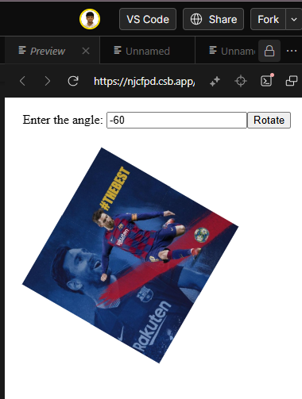

# New Approaches : Apply Rotation and Positioning for Individual Images


## **Step 1: Correct Image Placement**

first i placed the images at this position with simple values so, that in further steps i can calculate the rotation and positioning correctly.

- **Top-left (Image 1):** `(0, 0)`
    
- **Top-right (Image 2):** `(imgSize, 0)`
    
- **Bottom-left (Image 3):** `(0, imgSize)`
    
- **Bottom-right (Image 4):** `(imgSize, imgSize)`

`imgSize` : it is half the full image's width/height since the full image is split into 4 quadrants.

This I have done using `position : 'absolute'`, and set `left` and `top` values accordingly.

## **Step 2: Rotation And Positioning of Each Image**

Each image should rotate around the collective image’s center, which is calculated as:
$$

centerX = \frac{\text{fullImageSize}}{2} 
centerY=\frac{\text{fullImageSize}}{2}

$$

Each image's new position is calculated using this formula.

$$
x' = \cos(\theta) \cdot (x - \text{centerX}) - \sin(\theta) \cdot (y - \text{centerY}) + \text{centerX} 
$$

$$
y' = \sin(\theta) \cdot (x - \text{centerX}) + \cos(\theta) \cdot (y - \text{centerY}) + \text{centerY}
$$

Where:

- (x, y) is the image’s original top-left position.\
- (x', y') is the new rotated position.
- θ is the input angle in **radians**.
- **Cos and Sin** functions help in computing the new positions after rotation.
    

Each image is then moved to its **(x', y')** position using CSS `left` and `top`, and rotated using:

```css
transform: rotate(angle) translate(offsetX, offsetY);
```
- the `transform: rotate(theta deg)` is applied to each image to ensure it rotates along with repositioning.
 `offsetX` and `offsetY` are corrections to keep images properly aligned.

### __Code__ :
```javascript
import React from "react";

class App extends React.Component {
  constructor(props) {
    super(props);
    this.state = {
      angle: 0,
    };
  }

  rotateImage = () => {
    const angle = parseFloat(document.getElementById("angle").value) || 0;
    this.setState({ angle });
  };

  render() {
    const angle = this.state.angle;
    const cosA = Math.cos((angle * Math.PI) / 180);
    const sinA = Math.sin((angle * Math.PI) / 180);

    const positions = [
      { left: 0, top: 0 },
      { left: 100, top: 0 },
      { left: 0, top: 100 },
      { left: 100, top: 100 },
    ];

    const rotatedPositions = positions.map(({ left, top }) => {
      const newLeft = 100 + (left - 100) * cosA - (top - 100) * sinA;
      const newTop = 100 + (left - 100) * sinA + (top - 100) * cosA;
      return { left: newLeft, top: newTop };
    });

    return (
      <div className="App">
        <div className="inputTag">
          Enter the angle: <input type="text" name="angle" id="angle" />
          <button className="button" onClick={this.rotateImage}>
            Rotate
          </button>
        </div>
        <div
          className="container"
          style={{ position: "relative", width: "200px", height: "200px" }}
        >
          <div className="row">
            <div className="column">
              
            </div>
            <div className="column">
              
            </div>
          </div>
          <div className="row">
            <div className="column">
              
            </div>
            <div className="column">
              
            </div>
          </div>
        </div>
      </div>
    );
  }
}

export default App;
```


## __Using `.map()` to apply rotation and positioning for each image (iterative solution)
### __Code :__
```javascript

import React from "react";

class App extends React.Component {
  constructor(props) {
    super(props);

    this.state = { angle: 0 };
  }

  rotateImage = () => {
    const angle = document.getElementById("angle").value;

    this.setState({ angle: parseInt(angle, 10) || 0 });
  };

  render() {
    const rad = (Math.PI / 180) * this.state.angle;
    const cosA = Math.cos(rad);
    const sinA = Math.sin(rad); // Center coordinates
    const centerX = 100;
    const centerY = 100;
    const halfSize = 50;

    const initialPositions = [
      { x: -halfSize, y: -halfSize }, // Top-left
      { x: halfSize, y: -halfSize }, // Top-right
      { x: -halfSize, y: halfSize }, // Bottom-left
      { x: halfSize, y: halfSize }, // Bottom-right
    ];

    const positions = initialPositions.map(({ x, y }) => ({
      left: centerX + x * cosA - y * sinA,
      top: centerY + x * sinA + y * cosA,
    }));

    return (
      <div className="App">
        <div className="inputTag">
          Enter the angle: <input type="text" name="angle" id="angle" />
          <button className="button" onClick={this.rotateImage}>
            Rotate
          </button>
        </div>

        <div
          className="container"
          style={{ position: "relative", width: "200px", height: "200px" }}
        >
          {[
            "FfpJBC0y/image-part-001.jpg",
            "QVwKwTKy/image-part-002.jpg",
            "njw9HsRM/image-part-003.jpg",
            "4nmhW5yc/image-part-004.jpg",
          ].map((src, index) => (
            
          ))}
        </div>
      </div>
    );
  }
}

export default App;
```

### __Output Image :__



# Previous Approaches

## Approach First

First I tried to rotate each image 

### Code:
```Javascript
import React from "react";

class App extends React.Component {
  constructor(props) {
    super(props);
    this.state = { angle: 0 };
  }

  rotateImage = () => {
    const angle = document.getElementById("angle").value;
    this.setState({ angle: parseInt(angle, 10) || 0 });
  };

  render() {
    return (
      <div className="App">
        <div className="inputTag">
          Enter the angle: <input type="text" name="angle" id="angle" />
          <button className="button" onClick={this.rotateImage}>
            Rotate
          </button>

        </div>
        <div className="container">
          <div className="row">
            <div className="column">
              
            </div>
            <div className="column">
              
            </div>
          </div>
          <div className="row">
            <div className="column">
              
            </div>
            <div className="column">
              
            </div>
          </div>
        </div>
      </div>
    );
  }

}
export default App;
```

### Output Image


## Approach Second, Correct Results

- first I add all the images in a .image-container div.
- The apply `transform: rotation(angle)` in the style section of `.image-container` div.
- it will ensure all the four quadrants will rotate as a single unit.


### Code
```javascript
import React from "react";

class App extends React.Component {
  constructor(props) {
    super(props);
    this.state = { angle: 0 };
  }
  rotateImage = () => {
    const angle = document.getElementById("angle").value;
    this.setState({ angle: parseInt(angle, 10) || 0 });
  };

  render() {
    return (
      <div className="App">
        <div className="inputTag">
          Enter the angle: <input type="text" name="angle" id="angle" />
          <button className="button" onClick={this.rotateImage}>
            Rotate
          </button>
        </div>
        <div
          className="container"
          style={{
            display: "flex",
            justifyContent: "center",
            alignItems: "center",
          }}
        >
          <div
            className="image-container"
            style={{
              display: "grid",
              gridTemplateColumns: "1fr 1fr",
              transform: `rotate(${this.state.angle}deg)`,
              transition: "transform 0.5s ease-in-out",
            }}
          >
            
            
            
            
          </div>
        </div>
      </div>
    );
  }
}

export default App;

```

### Output Image :


